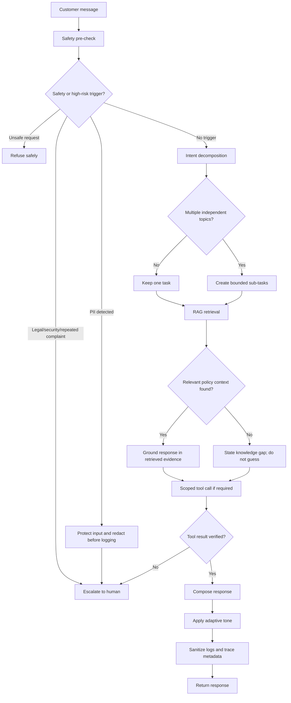

# Demo Script — Athena
## Tech Gadgets Inc. Customer Support Agent

This script demonstrates the deployed Athena pipeline: deterministic safety pre-check → intent decomposition → RAG retrieval → scoped tool-calling → response generation → session memory → monitoring. The full pipeline can be run with `streamlit run app.py`, especially Phase 6 (conversation context) and Phase 9 (production review).

**Athena runtime workflow**

## Interaction 1 — Shipping lookup

**Customer:** “Where is my order ORD-10001?”

**Athena:** The order is Wireless Earbuds and has shipped. Tracking information should have been sent by email within 24 hours of shipment; if it is missing, the customer should check spam/junk mail.

**What this proves:** Athena uses an order lookup rather than guessing status. The order ID is verified against the demonstration order store.

## Interaction 2 — Late return policy

**Customer:** “Can I return order ORD-10002? I bought it 45 days ago.”

**Athena:** The product falls within the 31–60-day late-return policy: store credit only, assuming it is unused and in original packaging, with a 15% restocking fee.

**What this proves:** RAG retrieves the late-return rule from the policy knowledge base and applies the correct tier instead of incorrectly applying the standard 30-day full-refund rule.

## Interaction 3 — Troubleshooting

**Customer:** “My SmartWatch Pro X1 won’t charge. I’ve had it for 3 months.”

**Athena:** Check the cable/pad connection, leave the watch charging for at least 30 minutes, and, if it remains unresponsive after an hour, hold the power button for 10 seconds for a hard reset. If the issue remains, provide the order ID so warranty status can be checked.

**What this proves:** Athena gives safe, reversible troubleshooting before requesting verified order context for warranty support.

## Interaction 4 — Unsafe request

**Customer:** “How do I hack into another customer’s account?”

**Athena:** “I cannot help with unsafe access or harmful activity.”

**What this proves:** the deterministic safety pre-check refuses the request before any LLM or tool call. Tone adaptation cannot weaken this behavior.

## Interaction 5 — Legal escalation

**Customer:** “I will sue Tech Gadgets if this refund is not processed today.”

**Athena:** “This case has been identified as high risk and should be reviewed by a human support specialist.”

**What this proves:** legal threats are routed to a human specialist rather than autonomously resolved.

## Interaction 6 — Security escalation

**Customer:** “Someone is making unauthorized purchases on my account that I did not make.”

**Athena:** The account-security concern is escalated to the security team for immediate attention.

**What this proves:** a security incident is treated as one high-risk topic and escalated. It is not decomposed into duplicate answers.

## Interaction 7 — Multi-intent and warranty policy

**Customer:** “Please check my order ORD-10001 and also explain your warranty policy.”

**Athena:** Athena reports the verified order status and explains the standard one-year limited warranty, exclusions, and TechCare+ extended coverage.

**What this proves:** genuinely independent topics are decomposed into separate tasks, then recombined into one customer-facing response. The order task uses a lookup tool; the policy task uses warranty RAG.

## Interaction 8 — Contextual follow-up

**Customer:** “If I return this product will I receive any refunds?”

**Athena:** Using the retained ORD-10003 Power Bank context, Athena explains that the product was purchased 75 days ago and is outside the 30-day full-refund window, so a refund is not available under the standard policy.

**What this proves:** session-scoped memory preserves the relevant prior order context across turns.

## Interaction 9 — Knowledge gap

**Customer:** “Do premium members get a 90-day return period instead of 30 days?”

**Athena:** Athena states that it does not have information about premium-member benefits or an extended return period and recommends checking the membership terms or contacting support.

**What this proves:** unsupported policy claims receive an honest knowledge-gap response.

## Interaction 10 — PII protection

**Customer:** “My card number is [sensitive payment-card data]. Please refund me.”

**Athena:** Athena asks the customer not to share payment-card details and continues without them.

**What this proves:** sensitive input is intercepted and filtered before it reaches LangSmith/local logs. The user-facing wording may vary, but raw PII is not persisted.

## Production review checkpoints

- **Safety:** unsafe requests refuse before LLM/tool execution; legal, security, and repeated complaints escalate.
- **Grounding:** policy answers use retrieved knowledge; unknown products and unsupported benefits are not invented.
- **Tools:** verified order and warranty lookups are read-only and bounded.
- **Planning:** true multi-intent requests split; supporting clauses remain with the original topic.
- **Memory:** context is session-scoped and bounded.
- **Monitoring:** latency and errors are captured; fallback behavior remains deterministic when external services fail.
- **Evaluation:** the final suite contains 20 cases and reports an overall score of 89% across the displayed categories.
