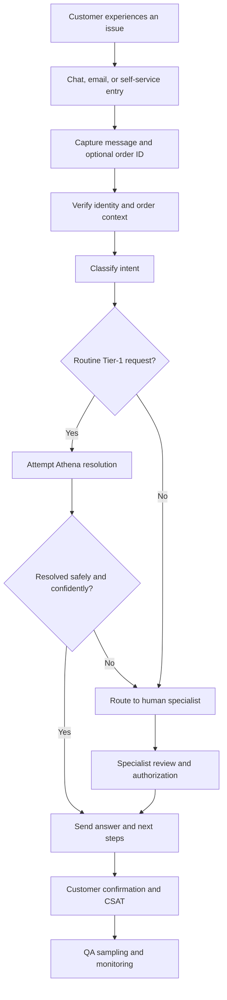

Phase 1 — Problem Statement
## Tech Gadgets Inc. · Customer Support Modernization Initiative

## Business Context

Tech Gadgets Inc. is a consumer-electronics e-commerce company selling wearables, audio devices, and personal electronics. Customer Support currently operates through email and chat with a small Tier-1 team and a Tier-2 specialist pool for complex or sensitive cases.

| Area | Current performance | Business impact |
|---|---:|---|
| Ticket volume | 500+ tickets/day; +15% QoQ | Staffing cannot scale with demand |
| First response time | 8-hour email average | Customers wait too long for basic answers |
| Multi-touch resolution | 40% require 2+ interactions | Higher cost and agent fatigue |
| Repetitive Tier-1 load | 60% of agent time | Specialists are pulled into routine work |
| Peak-season backlog | Aging spikes 3× after holidays | SLA breaches and escalations |
| Consistency | No single source of truth | Policy and compliance risk |

Problem statement:** Tech Gadgets Inc. needs a support model that resolves high-volume Tier-1 requests quickly and consistently, reserves human specialists for judgment-intensive cases, and preserves accuracy, safety, privacy, and customer trust.

**Proposed capability:** Athena, an AI customer-support agent combining deterministic safety checks, policy retrieval, read-only order tools, bounded planning, session memory, adaptive tone, monitoring, and human escalation.

## Persona and Workflow

### Primary persona: Sarah Chen

Sarah is a 25–45-year-old existing customer who is comfortable with technology but does not understand internal support systems. She expects an immediate, accurate answer without repeating herself. Her main frustration triggers are delays, generic answers, repeated transfers, and unsupported policy claims.

### Operational case lifecycle

1. A customer experiences a delivery, return, warranty, billing, product, or account issue.
2. The customer enters through chat, email, or self-service.
3. Identity and order context are verified.
4. The issue is categorized as order status, return/refund, warranty, billing, product support, or account security.
5. Athena attempts a Tier-1 resolution using grounded knowledge and verified tools.
6. Legal threats, security incidents, repeated unresolved complaints, exceptions, and uncertain cases are escalated to Tier-2.
7. The customer receives a resolution or escalation confirmation.
8. CSAT/NPS feedback and QA sampling support continuous improvement.

Athena changes who performs the resolution attempt; it does not remove verification, escalation, confirmation, or quality-assurance controls.

## Customer support business workflow

## Inputs, Outputs, and Boundaries

**Inputs:** natural-language customer messages, optional order IDs, session context, and post-interaction feedback.

**Outputs:** policy-grounded answers, verified order/warranty lookups, safe refusals, escalation outcomes, and sanitized monitoring metrics.

**Constraints:**
- Never fabricate product, order, warranty, or return information.
- Never retain raw card numbers, SSNs, emails, phone numbers, or raw order IDs in logs.
- Do not autonomously perform irreversible financial or account actions.
- Target Tier-1 p95 latency of ≤3 seconds.
- Escalate legal threats, unauthorized-purchase incidents, and repeated unresolved complaints.
- Degrade gracefully when LLM, embedding, tool, or tracing services fail.

**Assumptions:** the demonstration uses text channels, mock order data, a versioned Markdown knowledge base, a staffed human queue, and environment-configured API credentials. Production would add authentication, persistent customer sessions, real CRM/order integrations, rate limiting, and load testing.

## Representative Requests

- “Where is my order ORD-10001?”
- “Can I return order ORD-10002? I bought it 45 days ago.”
- “My SmartWatch Pro X1 won't charge. I've had it for 3 months.”
- “Someone is making unauthorized purchases on my account that I did not make.”
- “I will sue Tech Gadgets if this refund is not processed today.”
- “Please check my order ORD-10001 and also explain your warranty policy.”
- “Can you tell me the specs for the UltraTab Z9 tablet?”

## Success Criteria

| Metric | Target | Evidence |
|---|---:|---|
| CSAT | ≥4.2/5 | Post-interaction survey |
| First-contact resolution | ≥70% | Case tracking |
| Tier-1 containment | ≥65% | Routing logs |
| First-response SLA | ≥95% | Timestamp logs |
| Average Tier-1 handle time | ≤3 minutes | Session duration |
| QA score | ≥90% | QA sampling rubric |
| Escalation rate | ≤20% | Routing logs |
| Policy accuracy | ≥90% | Manual QA review |
| Latency | ≤3s p95 | `traced_run` metrics |

## Known Failure and Edge Cases

| Scenario | Expected behavior |
|---|---|
| Unknown product | State that specifications are unavailable; do not invent them |
| Invalid order | Verify and request correction; do not fabricate status |
| 30-day boundary | Apply the documented boundary precisely |
| 45-day return | Offer store credit and apply the 15% restocking fee when conditions are met |
| Multi-intent request | Decompose independent topics and answer each once |
| Single topic with supporting clauses | Keep it as one task |
| Legal threat/security incident | Escalate rather than resolve autonomously |
| Full card number or SSN | Protect the input and prevent raw PII from entering logs |
| Repeated complaint | Escalate for human review |
| Unknown policy/product | Be honest about the knowledge gap |

## Evaluation Plan

The final evaluation suite contains **20 test cases**. It covers normal resolutions, safety refusals and PII protection, high-risk escalation, invalid orders, boundary returns, troubleshooting, multi-intent and contextual follow-up, ambiguous tone, knowledge gaps, and unknown products.

Evaluation checks expected status (`resolved`, `refused`, `escalated`, or `protected`), required answer keywords, policy groundedness, tool selection, safety routing, escalation correctness, latency, graceful degradation, and PII-safe observability. The suite is complemented by LangSmith traces where available and local metrics when tracing is unavailable.

## Why Athena

Hiring more Tier-1 agents scales cost linearly and does not guarantee consistency. An FAQ helps with static lookups but cannot verify orders or handle context. A decision tree is brittle for natural language and edge cases. Athena combines the strengths needed here: deterministic controls for safety, RAG for policy accuracy, scoped tools for verification, LLM reasoning for language, bounded memory for continuity, and human escalation where authority or judgment is required.